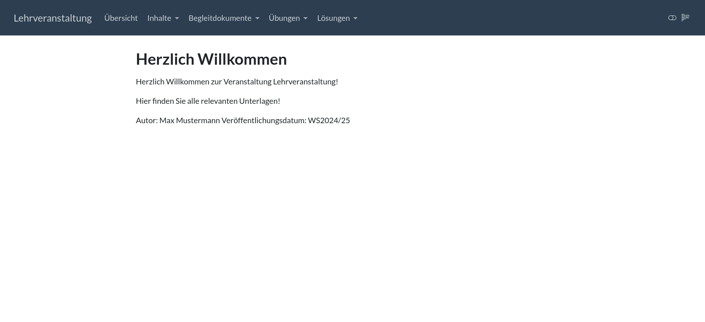
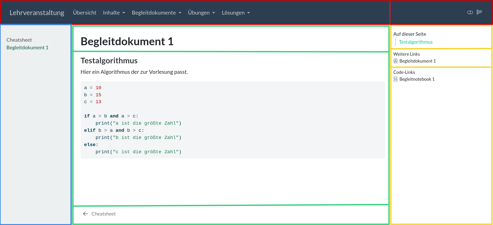

# Anwendung aus Studierendenperspektive

In diesem Abschnitt wird behandelt, wie das Projekt aus der Studierendenperspektive genutzt wird.

## Vorraussetzungen

Sie sollten die Website erfolgreich, wie am Ende des Installationsabschnitts beschrieben gerendert haben, indem Sie die Python-Befehle aus *render_website.ipynb* ausführen. Öffnen Sie jetzt die Datei *_output/index.html* in Ihrem Browser.

## Hauptmenü

Beim Aufrufen der Website ist man zunächst im Hauptmenü. Hier befindet sich eine kleine Übersicht über den Kurs. Über die Leiste oben kann man nun den Rest der Website navigieren.

## Reiter

Oben in der Navigationsleiste finden Sie einige Reiter, welche Ihnen Inhalte ausgeben. Hinter manchen dieser Reiter stehen mehrere Seiten, welche man durch ein Dropdown-Menü auswählen kann.

Folgende Reiter gibt es:

* **Lehrveranstaltung:** An diesem Punkt kommt man auf der Website an.

* **Übersicht:** Hier findet man genauere Informationen zur Lehrveranstaltung.

* **Inhalte:** Hier kann man die einzelnen inhaltlichen Kapitel der Lehrveranstaltung aufrufen.

* **Begleitdokumente:Cheatsheet:** Ein Cheatsheet, welches man bei der Klausur verwenden darf.

* **Begleitdokumente:Begleitdokument:** Begleitdokumente zu den Vorlesungen, die beispielsweise relevanten Code enthalten.

* **Übungen:** Übungsblätter mit einzelnen Aufgaben.

* **Lösungen:** Lösungen zu den Übungsblättern.

## Seitenaufbau

Die einzelnen html-Seiten haben eine bestimmte Struktur. Hier wird sie am Beispiel einer Begleitdokumentseite beschrieben.

* **Oben:Links:** Die bereits beschriebene Navigationsleiste.

* **Oben:Rechts:** Allgemeine Funktionalitäten für die Ansicht der Website.

* **Links:** Reiterinterne Navigation, mit der man sich also z.B. zwischen Begleitdokumenten bewegen kann.

* **Mitte:Oben:** Der Titel der Seite selbst, hier "Begleitdokument 1".

* **Mitte:Mitte:** Der eigentliche Inhalt der Seite. Standardmäßig oft Beispiele und Platzhalter. Besonders in der Beispielseite für Inhalte, sind viele hilfreiche Strukturen wie Tabellen, oder ausgeführter Code angegeben.

* **Mitte:Unten:** Reiterinterne Navigation zur nächsten und vorherigen Seite.

* **Rechts:Oben:** Seiteninterne Navigation.

* **Rechts:Mitte:** Hier ist häufig ein Link, mit welchem man sich die Seite als pdf herunterladen kann.

* **Rechts:Unten:** Hier ist manchmal ein Link, mit welchem man sich die Seite als ipynb herunterladen kann. BEACHTE: Erst wenn man die Website auf Moodle hochgeladen hat und von dort aus nutzt, funktioniert das Herunterladen der ipynbs.

## Navigation

[Vorseite](./installation.md) / [Nachseite](./anwendung-aus-dozierendenperspektive.md)
