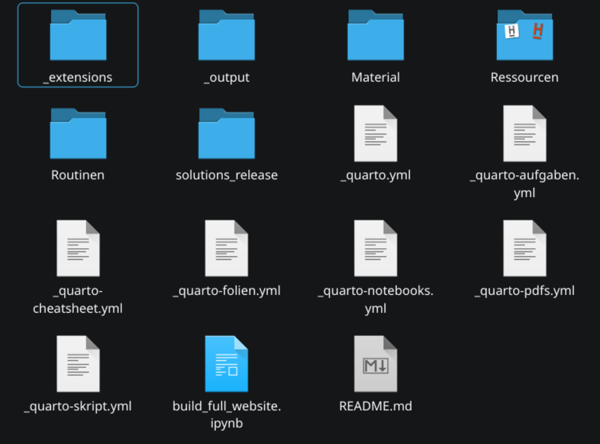

# Ordnerstruktur

Bevor das Hauptthema, nämlich die inhaltliche Anpassung der Unterlagen behandelt wird, geht es um die Ordnerstruktur des Projekts.

## Außen

Ganz außen sollte sich folgendes befinden:

Diese Inhalte werden wir nun nach und nach behandeln.

## _extensions

Dieser Ordner muss in den aller meisten fällen nicht beachtet werden. Hier befinden sich Extensions die beispielsweise für das rendern von pdfs relevant sind.

## _output

Das ist der Ihnen bereits bekannt output-Ordner. Hier finden Sie alles was Sie gerendert haben.

## Material

Dieser Ordner enthält die eigentlichen Inhalte der Website. Wie genau die Inhalte darin unterteilt sind, wird im Kapitel der inhaltlichen Abänderung der Website behandelt.

## Ressourcen

Für die Website selbst wichtige Bilder, nicht für die Inhalte.

## Routinen

Deklarative Entwicklungsumgebung in Nix. Nur relevant wenn Sie Nix nutzen.

## solutions_release

Enthält nur die zur Kapitelsteuerung relevante Datei. Wurde bereits [hier](./anwendung-aus-dozierendenperspektive.md#inhalte-zeitlich-freischalten) behandelt.

## _quarto*.yml

In diesen Dateien wird die eigentliche Website definiert. *_quarto.yml* ist dabei was bei einem *quarto render* beachtet wird. Alles andere sind die einzelnen Profile, welche man jeweils über die --profile flag ansprechen kann. 

Auch auf diese Dateien wird zukünftig noch genauer eingegangen.

## build_full_website.ipynb

Hier stehen bash Befehle in der Reihenfolge, mit der man die gesamte Website sauber neu bauen kann.

## README.md

Eine Infodatei für Github.

## Navigation

[Vorseite](./anwendung-aus-dozierendenperspektive.md) / [Nachseite]()
